# 🔄 Flow — End-to-End Feature Flows

> **Project:** WhatsApp Chat Analyzer Bot  
> **Version:** v1.0  
> **Last Updated:** 2026-06-10

---

## 1. Application Startup Flow

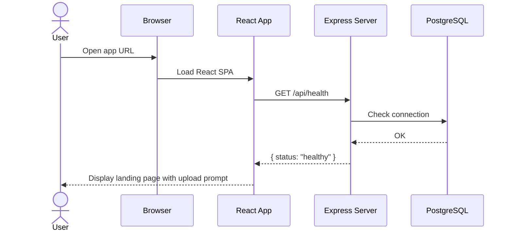

---

## 2. File Upload & Parsing Flow

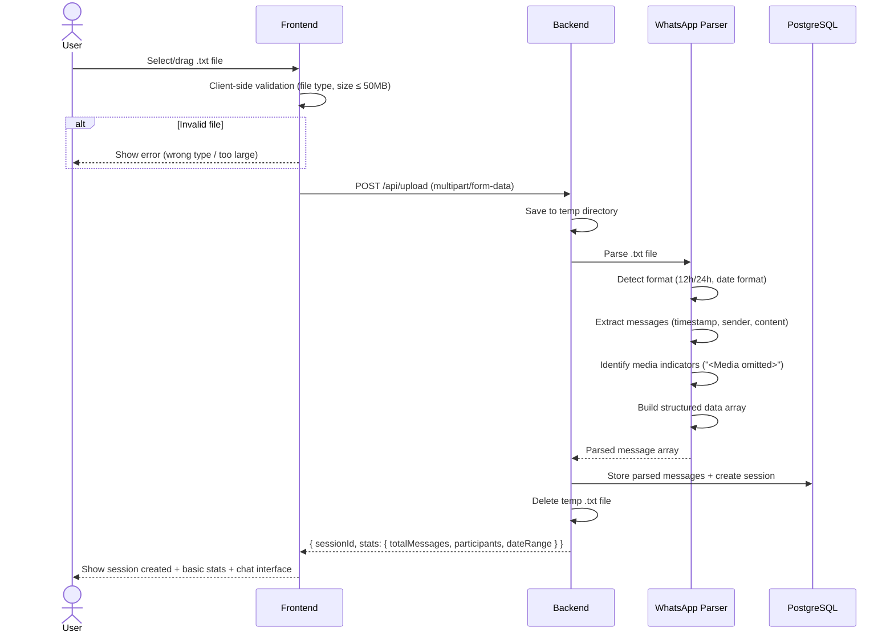

### WhatsApp .txt Format Detection

```
Format A (12h): "1/15/23, 9:45 PM - John: Hello"
Format B (24h): "15/01/2023, 21:45 - John: Hello"
Format C (US):  "01/15/2023, 9:45 PM - John: Hello"
Format D (BR):  "[15/01/2023 21:45:30] John: Hello"

Parser detects format via regex matching on first 10 lines.
```

---

## 3. Authentication Flow (JWT)

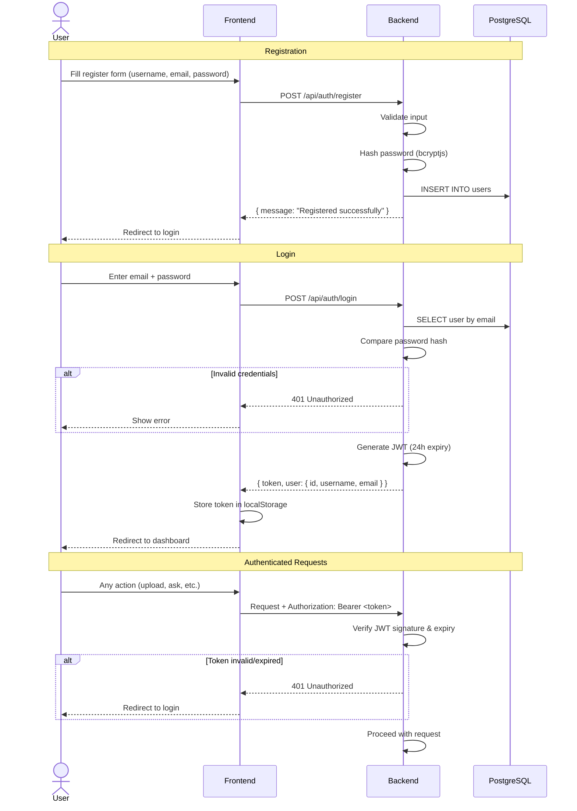

## 4. Chat Q&A Flow (Hybrid Query Processing)

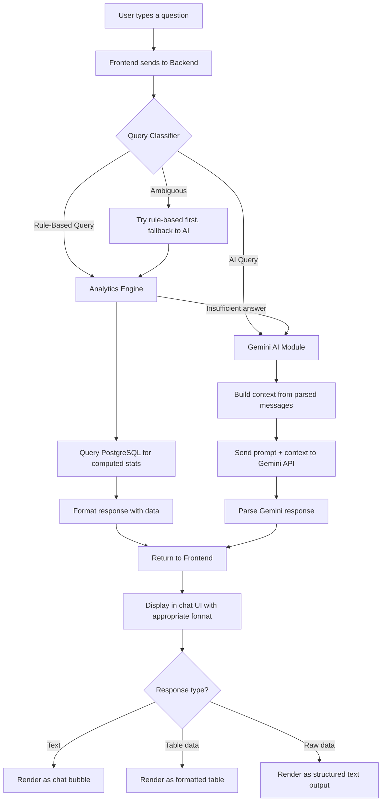

> **Note:** Chart rendering (bar, line, pie, word cloud) moves to Phase 2. Phase 1 returns all analytics as text and tables.

### Query Classification Rules

| Pattern / Keywords                           | Type        | Handler             |
|----------------------------------------------|-------------|----------------------|
| "how many messages", "message count"         | Rule-based  | Analytics Engine     |
| "most used word", "word frequency"           | Rule-based  | Analytics Engine     |
| "most active", "who sent the most"           | Rule-based  | Analytics Engine     |
| "how many photos/videos/files"               | Rule-based  | Analytics Engine     |
| "messages per day/week/month"                | Rule-based  | Analytics Engine     |
| "summarize", "summary"                       | AI          | Gemini Module        |
| "what is the mood", "sentiment"              | AI          | Gemini + Analytics   |
| "find anything related to"                   | AI          | Gemini Module        |
| "what happened between [date] and [date]"    | AI          | Gemini Module        |
| Everything else                              | AI          | Gemini Module        |

---

## 5. Session Management Flow

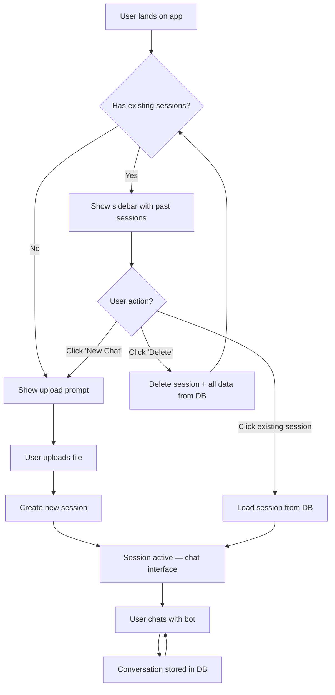

---

## 6. Analytics Feature Flows

### 5.1 Word Frequency Analysis

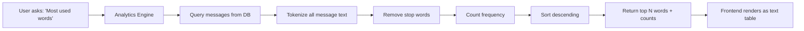

### 5.2 Per-Person Message Count

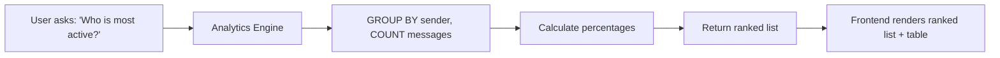

### 5.3 Activity Timeline

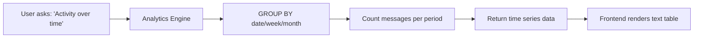

### 5.4 Media Statistics

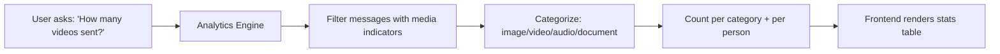

### 5.5 Sentiment Analysis

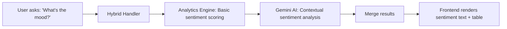

### 5.6 Date-Range Summary

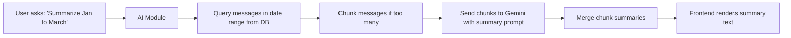

### 5.7 Keyword Search

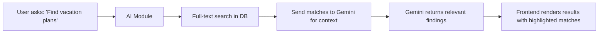

### 5.8 Export Results

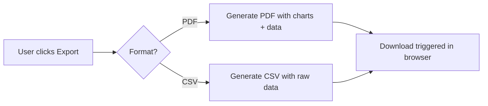

---

## 7. Data Deletion Flow

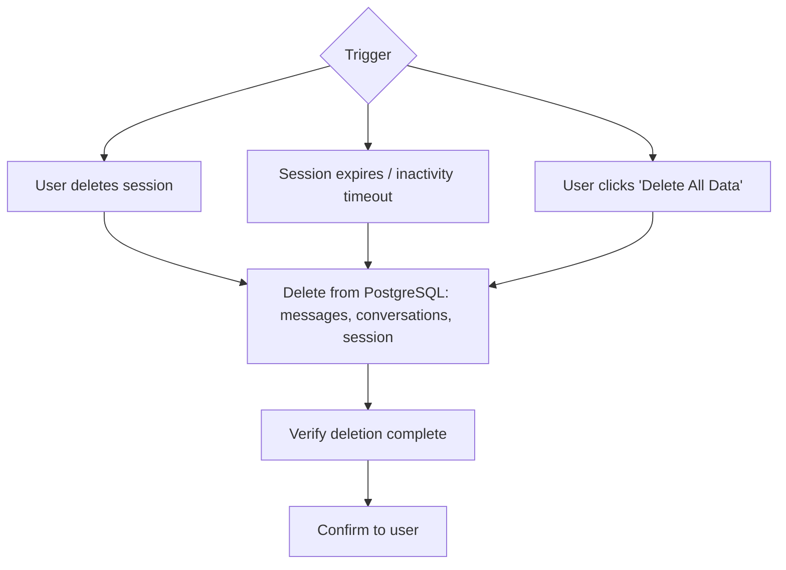

---

## 8. Error Handling Flow

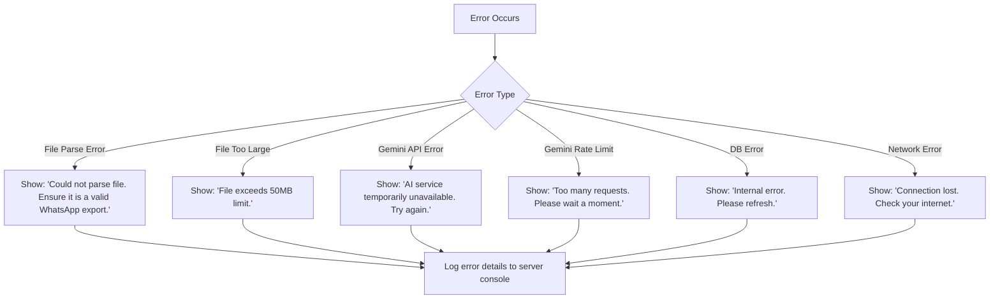

---

## 9. API Endpoint Map

| Method | Endpoint                          | Auth     | Purpose                              |
|--------|-----------------------------------|----------|--------------------------------------|
| GET    | `/api/health`                     | No       | Health check                         |
| POST   | `/api/auth/register`              | No       | Register new user                    |
| POST   | `/api/auth/login`                 | No       | Login, get JWT token                 |
| GET    | `/api/auth/me`                    | Yes      | Get current user profile             |
| POST   | `/api/upload`                     | Yes      | Upload WhatsApp .txt file            |
| GET    | `/api/sessions`                   | Yes      | List user's sessions                 |
| GET    | `/api/sessions/:id`               | Yes      | Get session details                  |
| DELETE | `/api/sessions/:id`               | Yes      | Delete session + all data            |
| POST   | `/api/sessions/:id/ask`           | Yes      | Ask a question about the chat        |
| GET    | `/api/sessions/:id/history`       | Yes      | Get conversation history             |
| GET    | `/api/sessions/:id/analytics/:type` | Yes    | Get specific analytics data          |
| GET    | `/api/sessions/:id/export/:format` | Yes     | Export results (pdf/csv)             |

---

> **Next Step:** Review flows. Then we proceed to `Database.md`.
