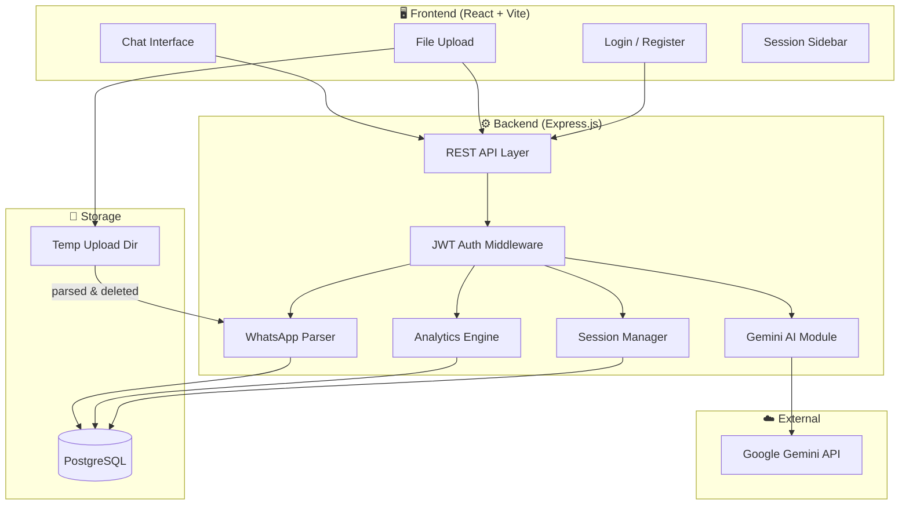

# 📋 Plan — WhatsApp Chat Analyzer AI Chatbot

> **Project Name:** WhatsApp Chat Analyzer Bot  
> **Version:** v1.0  
> **Created:** 2026-06-09  
> **Status:** 🟢 Implementation Phase — Full-Stack Code Complete, Testing Next

---

## 1. Project Overview

A web-based AI chatbot that ingests exported WhatsApp `.txt` chat files, parses and indexes the data, and allows users to ask natural language questions about their conversations. The bot combines **rule-based analytics** (word frequency, message counts, timelines) with **AI-powered analysis** (summaries, sentiment, contextual Q&A) using the Google Gemini API.

### Core Value Proposition
- Upload a WhatsApp chat export → instantly get an interactive AI analyst for that conversation.
- Ask anything: statistics, summaries, keyword searches, participant analysis, sentiment trends.

---

## 2. Software Requirements

### 2.1 Functional Requirements

| ID     | Requirement                                      | Priority | Phase |
|--------|--------------------------------------------------|----------|-------|
| FR-01  | Upload & parse WhatsApp `.txt` export files      | Must     | 1     |
| FR-02  | Word frequency analysis (text/table output)       | Must     | 1     |
| FR-03  | Message count per person (group chat support)     | Must     | 1     |
| FR-04  | Activity timeline (text/table output)             | Must     | 1     |
| FR-05  | Media statistics (photos, videos, docs count)     | Must     | 1     |
| FR-06  | Sentiment analysis per message / per person       | Must     | 1     |
| FR-07  | Date-range based chat summaries                   | Must     | 1     |
| FR-08  | Keyword/topic search across chat history          | Must     | 1     |
| FR-09  | Export analysis results as PDF/CSV                | Must     | 1     |
| FR-10  | Natural language Q&A via Gemini AI                | Must     | 1     |
| FR-11  | Chat history / conversation persistence           | Must     | 1     |
| FR-12  | Multiple chat sessions (sidebar navigation)       | Must     | 1     |
| FR-13  | Basic JWT authentication (register/login)         | Must     | 1     |
| FR-14  | Data auto-deletion after analysis session ends    | Must     | 1     |
| FR-15  | Chart visualizations (word cloud, bar, line, pie) | Should   | 2     |
| FR-16  | Admin dashboard (analytics, usage stats)          | Should   | 2     |
| FR-17  | Media file support (images, videos, documents)    | Could    | 3     |
| FR-18  | Multi-user scaling & advanced roles               | Could    | 3     |

### 2.2 Non-Functional Requirements

| ID      | Requirement                                         | Priority |
|---------|-----------------------------------------------------|----------|
| NFR-01  | Response time < 3s for rule-based queries            | Must     |
| NFR-02  | Response time < 10s for AI-generated responses       | Must     |
| NFR-03  | Support chat files up to 50MB                        | Must     |
| NFR-04  | Clean, modern, responsive UI                         | Must     |
| NFR-05  | Uploaded data deleted after session / user request    | Must     |
| NFR-06  | Graceful error handling with user-friendly messages   | Must     |

---

## 3. Prerequisites

### 3.1 Development Environment

| Tool              | Version   | Purpose                        |
|-------------------|-----------|--------------------------------|
| Node.js           | ≥ 18.x    | Backend runtime                |
| npm               | ≥ 9.x     | Package manager                |
| PostgreSQL        | ≥ 15.x    | Database server                |
| Git               | Latest    | Version control                |
| VS Code / IDE     | Latest    | Development                    |

### 3.2 API Keys & Services

| Service                | Purpose                          | Cost       |
|------------------------|----------------------------------|------------|
| Google Gemini API Key  | AI-powered chat Q&A             | Free tier  |

### 3.3 Knowledge Prerequisites

- JavaScript / TypeScript fundamentals
- REST API design
- Basic NLP concepts (tokenization, sentiment)
- WhatsApp export format understanding

---

## 4. Tech Stack (Locked)

```
┌─────────────────────────────────────────────────────────────┐
│                        FRONTEND                             │
│   React (Vite) + Vanilla CSS                                │
│   • Chat UI with sidebar sessions                           │
│   • File upload component                                   │
│   • Data displayed as text/tables (Phase 1)                 │
│   • Charts & visualizations (Phase 2)                       │
│   • PDF/CSV export                                          │
├─────────────────────────────────────────────────────────────┤
│                        BACKEND                              │
│   Node.js + Express.js                                      │
│   • REST API endpoints                                      │
│   • JWT authentication (jsonwebtoken + bcryptjs)            │
│   • WhatsApp .txt parser (custom module)                    │
│   • Analytics engine (rule-based)                           │
│   • Gemini AI integration (natural language Q&A)            │
│   • Session management                                      │
├─────────────────────────────────────────────────────────────┤
│                       DATABASE                              │
│   PostgreSQL (via pg / node-postgres)                       │
│   • Full-featured relational DB with proper types           │
│   • Connection pooling for performance                      │
│   • Native TIMESTAMP, JSONB, full-text search               │
│   • Scales natively to multi-user without migration         │
├─────────────────────────────────────────────────────────────┤
│                     EXTERNAL APIs                           │
│   Google Gemini API (gemini-2.0-flash)                      │
│   • Chat summarization                                      │
│   • Sentiment analysis                                      │
│   • Natural language question answering                     │
└─────────────────────────────────────────────────────────────┘
```

### Why This Stack?

| Decision         | Reason                                                                 |
|------------------|------------------------------------------------------------------------|
| **React (Vite)** | Fast dev server, modern tooling, component-based UI for chat interface |
| **Express.js**   | Minimal, flexible, huge ecosystem, easy to learn                       |
| **PostgreSQL**   | Proper data types, connection pooling, scales without migration        |
| **JWT Auth**     | Stateless, lightweight, works well with Express + React SPA            |
| **Gemini API**   | Free tier, powerful, Google-backed, good for text analysis             |
| **Vanilla CSS**  | Full control, no framework lock-in, maximum flexibility                |

---

## 5. Architecture Blueprint

### 5.1 High-Level Architecture



### 5.2 Module Breakdown

| Module               | Responsibility                                          |
|----------------------|---------------------------------------------------------|
| **Auth Module**      | JWT token generation, verification, password hashing    |
| **WhatsApp Parser**  | Parse `.txt` export → structured data (messages, timestamps, senders, media indicators) |
| **Analytics Engine** | Rule-based computations: word freq, msg counts, timelines, media stats |
| **AI Module**        | Send parsed context + user question → Gemini API → return answer |
| **Session Manager**  | Create/manage/delete chat analysis sessions             |
| **Export Module**    | Generate PDF/CSV from analytics results                  |

### 5.3 Query Classification Flow

```
User Question
     │
     ▼
┌─────────────────┐
│ Query Classifier │ ── Determines if the question is:
└─────────────────┘
     │
     ├── RULE-BASED → Analytics Engine (fast, deterministic)
     │   Examples: "How many messages?", "Most used word?",
     │             "Who sent the most messages?"
     │
     └── AI-POWERED → Gemini API (contextual, nuanced)
         Examples: "Summarize chat from Jan to March",
                   "What's the overall mood of this group?",
                   "Find anything related to 'vacation plans'"
```

---

## 6. Project Phases

### Phase 1 — Core MVP (Current)
- Basic JWT authentication — register/login (FR-13)
- WhatsApp `.txt` file upload & parsing (FR-01)
- All analytics features with text/table output (FR-02 through FR-09)
- AI Q&A with Gemini (FR-10)
- Chat session management (FR-11, FR-12)
- Data deletion (FR-14)
- Modern chat UI (responses as text, tables, formatted data)

### Phase 2 — Visualizations & Admin
- Chart visualizations: word cloud, bar, line, pie charts (FR-15)
- Admin dashboard (FR-16)
- Enhanced error handling
- Performance optimization
- UI/UX refinements

### Phase 3 — Scale
- Media file support (FR-17)
- Multi-user scaling & advanced roles (FR-18)
- Cloud deployment
- Rate limiting & security hardening

---

## 7. Risks & Mitigations

| Risk                                      | Impact | Mitigation                                      |
|-------------------------------------------|--------|------------------------------------------------|
| Gemini API rate limits on free tier        | High   | Cache responses, batch queries, use rule-based where possible |
| Large chat files causing memory issues     | Medium | Stream parsing, chunk processing, 50MB limit    |
| WhatsApp export format changes            | Low    | Flexible regex parser with format detection      |
| Sensitive data exposure                   | High   | JWT auth + auto-delete after session + bcrypt password hashing |
| PostgreSQL setup complexity               | Low    | Well-documented, one-time setup, Docker option available |

---

> **Next Step:** Review and approve this plan. Then we proceed to `Flow.md`.
